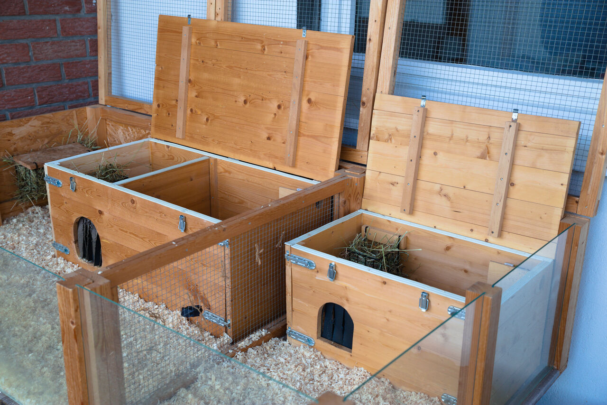
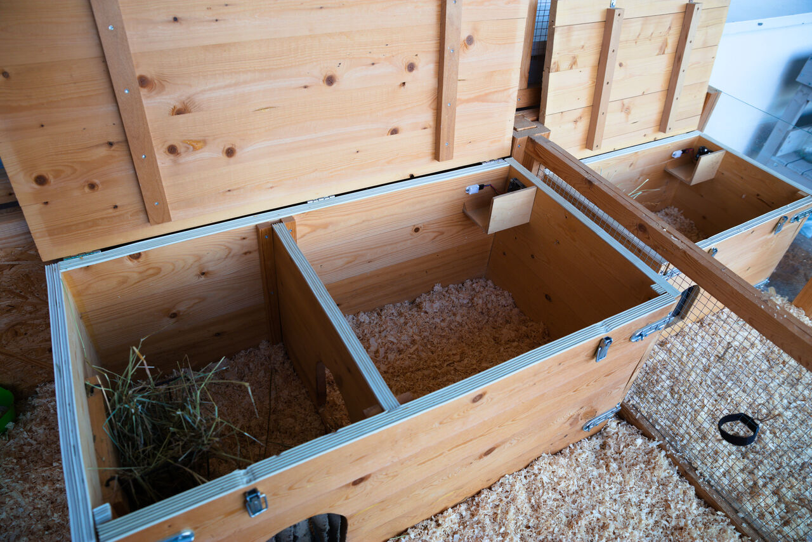
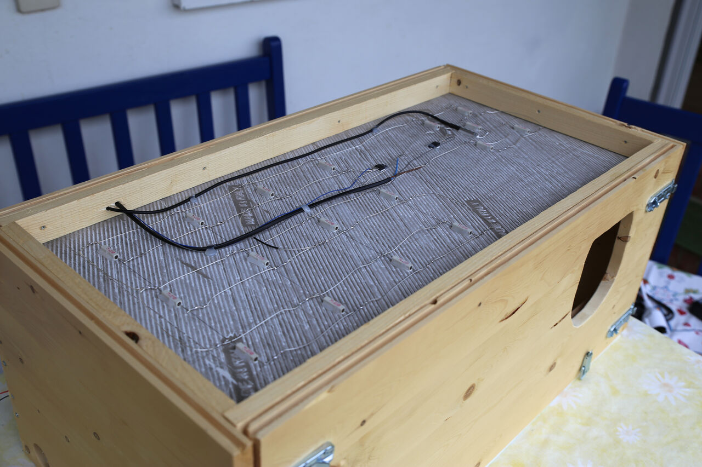
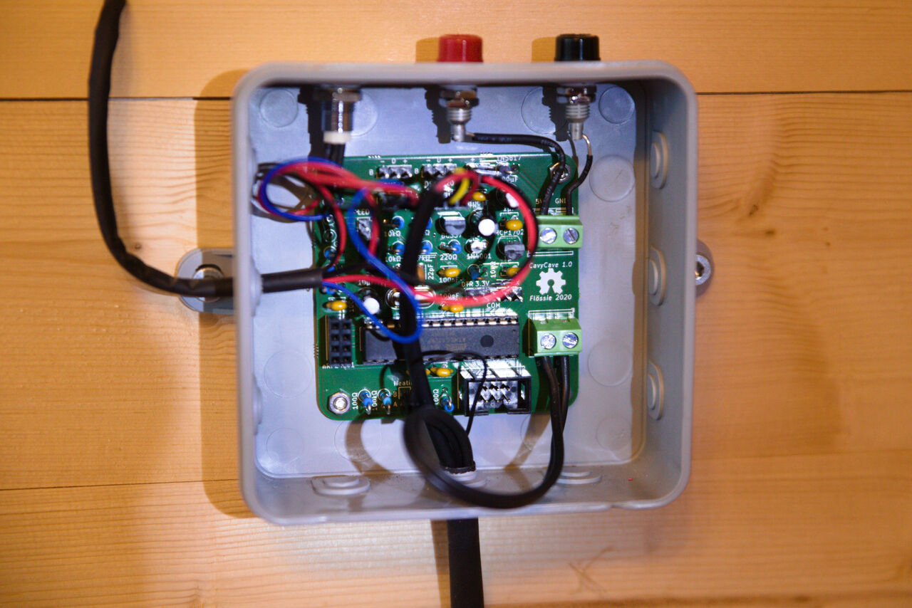

# CavyCave (hardware)

[![CC BY-SA 4.0][cc-by-sa-shield]][cc-by-sa]

## About

*CavyCave* is a temperature controlled box for guinea pigs and other small animals kept outside in winter. This repository holds the KiCad files for the controller board.

### The box

The box is built around a dark floor tile on a base frame of battens. Walls and top cover are made of 17&nbsp;mm thick, glued spruce floorboards. The front wall is fixed with four latches and can be removed for cleaning the interior. A number of load resistors fixed with thermal glue underneath the tile provide comfortable warmth to the top, helped by a polyurethane panel, which is clamped into the base frame at the bottom.

A hole in the top right corner of the box serves together with a fan as the exhaust air outlet. To protect the cavies from inspecting the fan too closely, a two-walled plywood housing is glued onto the backside of the box corner.

Two sensors monitor the temperature and humidity: a DHT22 for air temperature and humidity located in the top right corner of the box near the fan, and a cased DS18B20 under the tile for the floor temperature.

                       | 
-----------------------------------------------------|-------------------------------------------------
 | 

### The controller board

The heart and brain of the controller board is an ATmega328P-PU as found on the popular Arduino boards. Internally supplied with 3.3&nbsp;volts it connects two DHT22 temperature and humdity sensors and two DS18B20 temperature sensors as input and drives two heating circuits and one fan. The input voltage for the board, the fan, and the heating is 5&nbsp;volts. Depending on the load resistors the heating power is about 15 to 20&nbsp;watts.

The control system can be monitored, configured and remotely controlled by an nRF24L01+.

#### BOM

Quantity | Part | Mandatory
---------|------|----------
1 | Diode 1N5817 | :heavy_check_mark:
1 | Diode 1N4001 | :heavy_check_mark:
2 | Capacitor 22pF |
5 | Capacitor 100nF | :heavy_check_mark:
1 | Capacitor 100nF |
2 | Capacitor 1µF | :heavy_check_mark:
1 | Capacitor 10µF | :heavy_check_mark:
1 | Capacitor 10µF |
1 | Capacitor 100µF | :heavy_check_mark:
1 | Resistor 100Ω | :heavy_check_mark:
1 | Resistor 100Ω |
1 | Resistor 220Ω | :heavy_check_mark:
1 | Resistor 4.7kΩ | :heavy_check_mark:
1 | Resistor 4.7kΩ |
2 | Resistor 10kΩ | :heavy_check_mark:
1 | Resistor 10kΩ |
1 | Resistor 100kΩ | :heavy_check_mark:
1 | Resistor 100kΩ |
1-6 | Resistor for LED | :heavy_check_mark:
12-18 | Load resistor 22Ω VitrOhm KH208-810B22R | :heavy_check_mark:
2m+ | Silver plated copper wire 0.8mm | :heavy_check_mark:
1 | Bicolor (3 pin, CC) or RGB (4 pin, CC) LED | :heavy_check_mark:
1 | Transistor BC337-40 | :heavy_check_mark:
1 | LDO regulator MCP1702-3002 | :heavy_check_mark:
2 | Terminal block RND 205-00232 | :heavy_check_mark:
1 | Black 4mm socket Hirschmann 930 176-100 |
1 | Red 4mm socket Hirschmann 930 176-101 |
1 | MOSFET IRLIZ34N | :heavy_check_mark:
1 | MOSFET IRLIZ34N |
1 | Sensor DHT22 | :heavy_check_mark:
1 | Sensor DHT22 |
1 | Sensor DS18B20 | :heavy_check_mark:
1 | Sensor DS18B20 |
1 | Fan Sunon MB40100V2-000U-A99 | :heavy_check_mark:
1 | Crystal HC49U 8MHz |
1 | Pin socket 2x4 |
1 | IDC header 2x3 |
1 | Radio module nRF24L01+ |
x | Single row pin headers | :heavy_check_mark:

### History

This project started in the fall of 2018 with a large box for four cavies and two "rooms" ("vestibule" and "lounge") seperately heated. When one cavy was pushed out of the group in summer 2019 another smaller box had to be built, which has only one heating circuit. For the first box I experimented with 9V input to get 30&nbsp;watts heating power, but that was too much for the polyurethane panel and resulted in hot spots over the load resistors. Still, this could be a solution for even larger boxes with more and higher resistive load resistors as it's easier to find high power 9V supplies than 5V supplies. The fan must then be adjusted accordingly. The MCP1702-3002 LDO regulator for the internal 3.3&nbsp;volts supports up to 13.2&nbsp;volts input operating voltage.

The prototype circuit proved itself two winters, so now it was time to convert it to a real PCB.

## License

This work is licensed under a
[Creative Commons Attribution-ShareAlike 4.0 International License][cc-by-sa].

[![CC BY-SA 4.0][cc-by-sa-image]][cc-by-sa]

[cc-by-sa]: http://creativecommons.org/licenses/by-sa/4.0/
[cc-by-sa-image]: https://licensebuttons.net/l/by-sa/4.0/88x31.png
[cc-by-sa-shield]: https://img.shields.io/badge/License-CC%20BY--SA%204.0-lightgrey.svg
